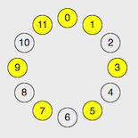
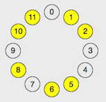
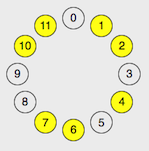
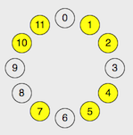

### Key Wheel ###

[Live](http://www.seanoreilly.co/KeyWheel)

**I'VE NEVER PLAYED MUSIC BEFORE THOUGH**

The vast majority of music is built on the 12-tone system. These 12 notes work like a clock. Count up and you'll eventually reach the same note again, only higher in pitch. However, people don't usually use all 12 of the tones in one song. Instead, they chose a "scale" out of the 12 tones (some selection of anywhere between 5 and 8, but generally 7 of these notes) and only play these during a song. The most common scale used is the Major(Ionian) scale, which sounds like "Do Re Mi Fa So La Ti Do". On the clock, Major looks like...

//major clock

and is defined by the specific ring of intervals (2,2,1,2,2,2,1) between notes.

**But surely we're not that boring, we use others right???**

Of course! After doing some math, there are 38 unique choices of 7 note scales on a clock, where each choice counts for all 12 rotations of that choice. Blah Blah...Group Theory stuff...Woah there's only 4-8 really interesting choices of the 38! (ping me if your curious)

//cool scales

//Honorary Choices

These all have the commonality that they are spaced out...there are not clumps of three or more notes on the clock, and no gaps with an interval of more than 3 clock steps. They happen to contain a lot of cool and essential symmetric properties, which adds to their sonic value as choices of scales.

## tl:dr

The Key Wheel is a network of 7 note scales. The choices of the notes on the clock are shown at each vertex, and they are connected to scales on their diagonals, which only differ by one pitch moved one clock step up or down. Some simple rules are baked into which notes are able to be adjusted, and the network yielded describes sonic distance of all diatonic(major), melodic minor(altered), and wholetone(neapolitan) scales.

This tool can be used by musicians to understand their scale changes, and locality of certain chords in certain choices of scale.
