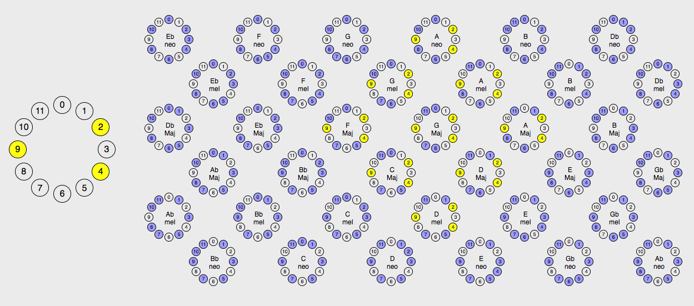

# Key Wheel #

[Live](http://www.seanoreilly.co/KeyWheel)

### Examples

## TL:DR

**BUT SEANJAMS, I'VE NEVER PLAYED MUSIC BEFORE!!!**

Fear not, jive turkey! The vast majority of music is built on the 12-tone system. These 12 notes work like a clock. Count up and you'll eventually reach the same note again, only higher in pitch. However, people don't usually use all 12 of the tones in one song. Instead, they chose a "scale" out of the 12 tones (some selection of anywhere between 5 and 8, but generally 7 of these notes) and only play these during a song. The most common scale used is the Major(Ionian) scale, which sounds like "Do Re Mi Fa So La Ti Do". You may have heard it...a lot. On the clock, Major looks like:

### Major Scale Rooted at 0

and is defined by the specific ring of intervals (2,2,1,2,2,2,1) between notes. As ring implies, we can rotate this scale in any way and it stays Major. All that changes is the **root**.

**But surely we're not that boring, we use others right???**

Of course! After doing some math, there are 38 unique choices of 7 note scales on a clock (counting for all rotations), and blah blah...group theory stuff...Woah **there's only 4 to 8 really interesting choices** of the 38! (ping me if your curious)

### Cool Scales

| Major (Ionian)  | Melodic Minor | Neapolitan  |  Hungarian  |
|:---:|:---:|:---:|:---:|
|  | |  |   |

### Honorary Choices

| Harmonic Major | Harmonic Minor | Eastern Major | Eastern Minor |
|:---:|:---:|:---:|:---:|
|     |  |        |   |

These all have the commonality that they are spaced out, there are no clumps of more than three notes on the clock, and no gaps with an interval of more than 3 clock steps. They happen to contain a lot of cool and essential symmetric properties, which adds to their sonic value as choices of scales.

## OK, so what is this thing?

The Key Wheel is a network of 7 note scales. The choices of the notes on the clock are shown at each vertex, and they are connected to scales on their diagonals, which only differ by one pitch moved one clock step up or down. Some simple rules, discovered during my mathematical research at UC Davis, are baked into which notes are able to be adjusted, and the network yielded provides a visual understanding of sonic "distance" between all Diatonic (Major, Ionian), Melodic Minor (Altered), and Wholetone (Neapolitan) scales.

This tool can be used by musicians in a variety of ways:

1. Like the Circle of Fifths? Who doesn't! You may notice it embedded in the central scales horizontally, traveling from Major key to Major Key. This clearly isn't the only way to get around! There are plenty of other cycles that make just as much sense in this perspective, and are worthy of experimentation.

2. Jamming with your friends or writing a song? What chord should I go to next? Plug in the notes you currently have and let the Key Wheel give you suggestions.

3. The Key Wheel introduces a concept of distance between certain scale choices, and therefore sound. Musicians that write music that changes keys can use it to traverse the scales in clever ways towards a desired "far away" place.

### Future Features...

- Currently working on extending the Key Wheel to involve the other Cool Scales and Honorary Choices. So far I've discovered a new set of rules that adds Harmonic Major and Harmonic Minor to the picture, but requires a 3 dimensional rendering.
